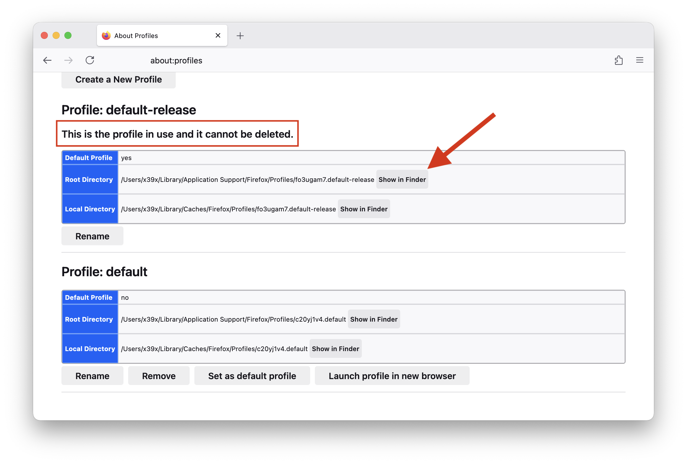
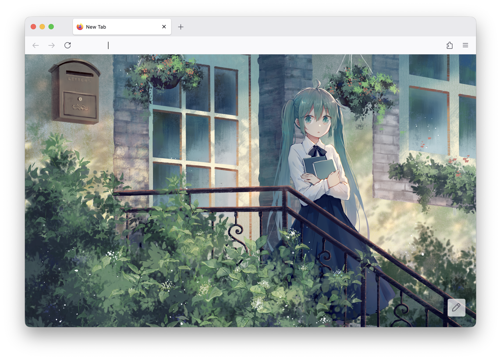

# 基础配置

## Setting

MacOS下 按 `Command+,` （或地址栏输入 `about:preferences` ）进入设置页，这里能配置的比较少，主要关掉一些提醒和搜索推荐

- General
    1. Always check if Firefox is your default browser
    2. Ask before quitting with CMD Q

- Search
    1. Show trending search suggestions
    2. Address Bar ,close all

## about:config

地址栏输入 `about:config` 接受风险提示后进入，这里有更多高级选项可以配置

```sh
# disable the tab animation
add ui.prefersReducedMotion number set its value to 1

# Disable Qucik Search
set accessibility.typeaheadfind.manual to false

# don't exit on escap
set browser.fullscreen.exit_on_escape to false

# 禁用 tab hover
set browser.tabs.hoverPreview.enabled to false

# 禁用 hover 显示 tab 缩略图
set browser.tabs.hoverPreview.showThumbnails to false
```

# 美化

Firefox 可定制程度非常高，几乎每个地方都可以使用 css 自定义

css 文件需要放在 Firefox 配置文件夹，Linux 在 `~/.mozilla/firefox/` 下，MacOS 位于 `~/Library/Application Support/Firefox/`
具体取决于系统及 Firefox 版本

可以在地址栏输入 `about:profiles` 查看，一般有两个配置，认准 「This is the profile in use and
it cannot be deleted. 」



进入到配置目录里，新建一个名为 chrome 的文件夹， 在 chrome 文件夹里放入背景图片，并新建两个文件： `userChrome.css` `userContent.css`

```sh
cd '~/Library/Application Support/Firefox/Profiles/fo3ugam7.default-release'
mkdir chrome
touch userContent.css userChrome.css
```

`userChrome.css` 负责Firefox 浏览器界面本身，如标签栏、地址栏、工具栏、侧边栏、按钮等外观；`userContent.css` 负责网页内容区域

> chrome 在 Firefox 里指浏览器界面，Google 直接拿去当自家浏览器名了

## Homepage 背景

突然发现 Firefox 已经支持自定义背景图了！终于 (: ，打开新标签，点击右下角 ✏️ 按钮就行，但我希望隐藏掉 Homepage
一些不必要的元素，比如 Firefox 图标，谷歌搜索框等，依旧采用 userContent.css 自定义

```css
/* === Apply this style only to Firefox Home, New Tab, and Private Browsing pages === */
@-moz-document url(about:home), url(about:newtab), url(about:privatebrowsing) {
    /* === 隐藏 Firefox 图标 === */
    .logo-and-wordmark {
        display: none !important;
    }

    /* === 隐藏搜索框 === */
    .search-inner-wrapper {
        display: none !important;
    }

    /* === 设置背景图片 ===*/
    body::before {
        content: "";
        z-index: -1;
        position: fixed;
        top: 0;
        left: 0;
        background: no-repeat url(bg.png) center;
        background-size: cover;
        width: 100vw;
        height: 100vh;
    }
}
```

## 精简浏览器界面

地址栏、toolbar 上有很多不用的按钮，在 userChrome.css 里隐藏他们

```css
/* === Remove the "Search with..." suggestion in the address bar === */
#urlbar-input::placeholder {
    color: transparent !important;
}

/* === Address bar: 去除地址栏不必要的 css 效果 === */
.urlbar-background {
    border: none !important;
    box-shadow: none !important;
    outline: none !important;
    background: var(--toolbar-bgcolor) !important;
}

/* === 隐藏视频全屏警告 === */
#fullscreen-warning {
    display: none !important;
}

/* === 隐藏地址栏和 toolbar  中不用的按钮 === */
#urlbar-searchmode-switcher,
#searchmode-switcher-chicklet,
#identity-permission-box,
#star-button-box,
#alltabs-button,
#identity-icon-box,
#picture-in-picture-button,
#tracking-protection-icon-container,
#reader-mode-button,
#translations-button {
    display: none !important;
}
```

## 效果



# 其他

## 远程调试

使用远程调试功能可以很方便的查看 Firefox 原生的 CSS 样式，自定义 css 时很有用

启用步骤：

1. 地址栏输入 about:config
2. devtools.chrome.enabled 设置为 true
3. devtools.debugger.remote-enabled 设置为 true
4. 重启 Firefox

快捷键：

macOS: Cmd + Option + Shift + I

Windows / Linux: Ctrl + Shift + Alt + I

## 修改 Accel Key

accel key 就是新建 tab，关闭 tab 时使用的那个键，Mac 上是 Command，Linux/Win 上是 control，如果你希望在 Linux / macOS
上快捷键保持一致，可以在 about:config 里修改 ui.key.accelKey 为 91

[参考](https://increaseyourgeek.wordpress.com/2010/01/28/osx-style-keyboard-shortcuts-for-firefox-on-pc)

```sh
0 => 禁用
17 => Ctrl键
18 => Alt/Option
91 => win/cmd
224 => Meta（Mac上的命令键??）
```

`ui.key.menuAccessKey` : 显示顶部菜单（Linux/win）

> Mac使用Control作为“generalAccessKey”，它作为“chromeAccessKey”和“contentAccessKey”发挥着双重作用，
