首先介绍一些字体合集，适用于解决系统层面的字体缺失问题

# Noto 与 思源

[Noto](https://fonts.google.com/noto) is a collection of high-quality fonts with multiple weights and widths in sans, serif, mono, and other styles. The Noto fonts are perfect for harmonious, aesthetic, and typographically correct global communication, in more than 1,000 languages and over 150 writing systems.

"Noto" means "I write, I mark, I note" in Latin. The name is also short for "no tofu", as the project aims to eliminate 'tofu': blank rectangles shown when no font is available for your text.

其中CJK字体是Goole与Adobe合作开发的，Adobe的[思源系列](https://github.com/orgs/adobe-fonts)基本是Noto的子集，像Math、Malayalam之类的Adobe是没有的，毕竟需求不同，Google是面向全球用户，Adobe更多聚焦设计领域，同类型的还有[IBM Plex](https://github.com/IBM/plex)，应该是出于和谷歌同样需求而开发的，没什么特点，但毕竟多一种选择

# 等宽字体

主要是代码编辑器里使用

### Geist

[Geist](https://github.com/vercel/geist-font)字体设计时参考了SF Mono、SF Pro等，Geist Mono可作为SF Mono替代，在浏览器里显示效果很好

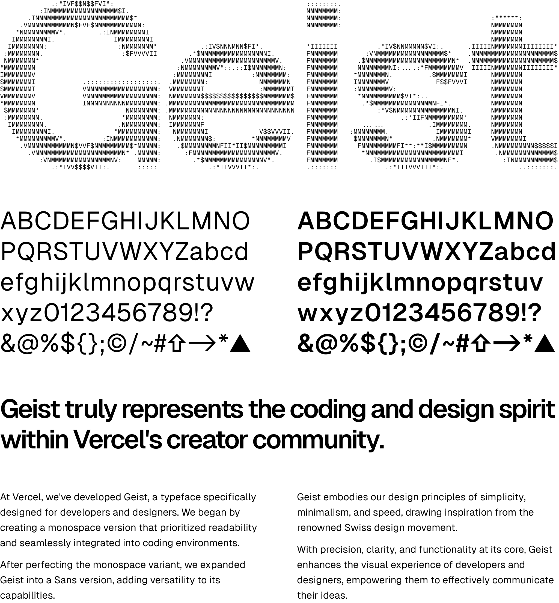

Geist Sans 是一款无衬线字体，设计注重易读性和简洁性。它是一款现代几何字体，基于经典的瑞士字体设计原则。适用于标题、海报和其他大尺寸展示用途

Geist Mono 是一款等宽字体，旨在与 Geist Sans 完美搭配。它适用于代码编辑器、图表、终端和其他用于显示代码的文本界面

### Iosevka

[Iosevka](http://be5invis.github.io/Iosevka)比常规字体要略窄一点，棱角分明，比较硬朗整齐，在终端里显示效果很好，还有专为终端优化的Term版，
[作者](https://www.zhihu.com/people/be5invis/answers)是国人，还做了一款基于Iosevka可以中英文严格对齐的[更纱黑体](https://github.com/be5invis/Sarasa-Gothic)

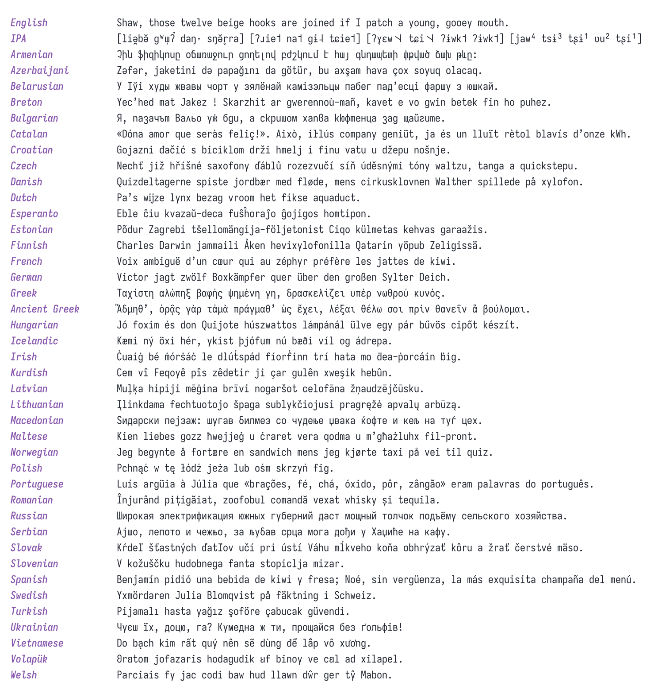

### [JetBrains Mono](https://github.com/JetBrains/JetBrainsMono)

JetBrains IDE中的默认字体，个人觉得和Iosevka风格很像，但还是Iosevka看着比较习惯

### [Go](https://go.dev/blog/go-fonts)

Golang 语言官方出的字体，关于一门编程语言为什么要做一款字体，他们是这样解释的

> The experimental user interface toolkit being built at golang.org/x/exp/shiny includes several text elements, but there is a problem with testing them: What font should be used? Answering this question led us to today’s announcement, the release of a family of high-quality WGL4 TrueType fonts, created by the Bigelow & Holmes type foundry specifically for the Go project.

有两种字形，其中Go Mono有点像衬线体，等宽字体这样的设计很少，可以偶尔换换口味用

- Go Regular

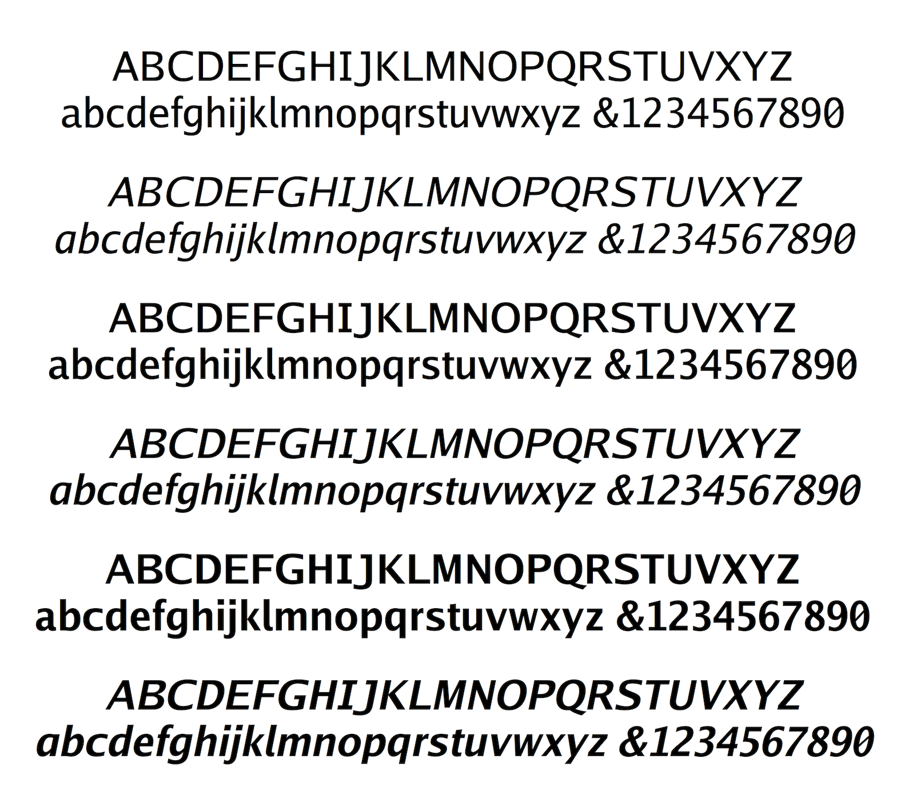

- Go Mono

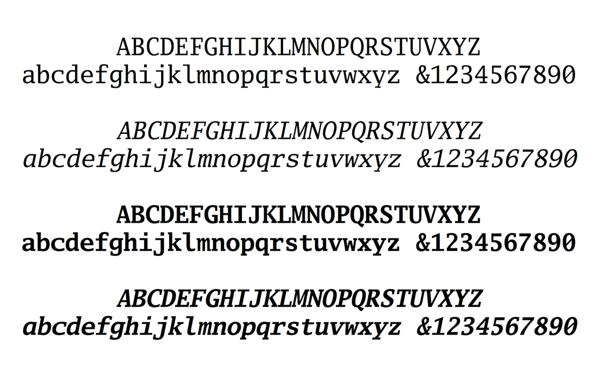

- 代码显示效果

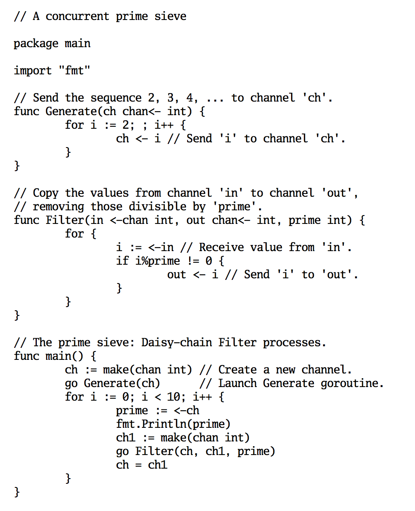

# 衬线体

### Caslon

巴洛克风格，美国独立宣言使用字体

有很多不同的版本，Adobe Caslon是比较优秀的一款，[纽约客官网](https://newyorker.com/)使用的就是Adobe Caslon，没Times New Roman那么严肃，更适合纸质书，网页里看着有点累眼

- 印刷效果「Adobe Caslon」

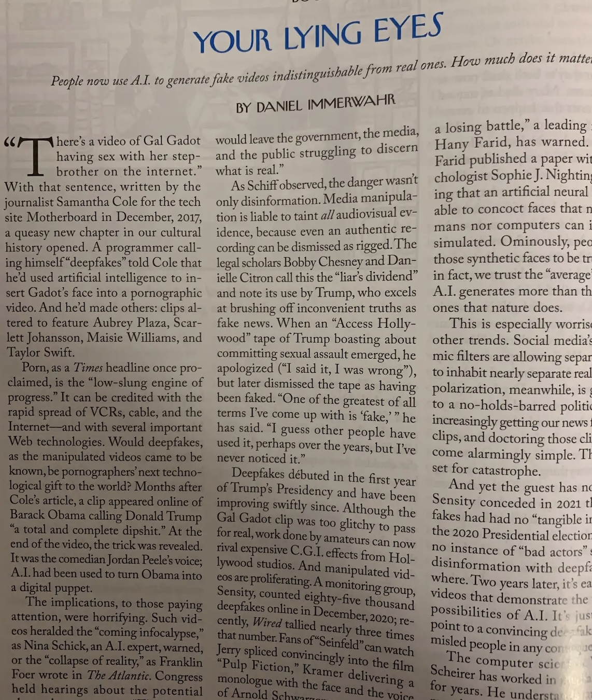

- 网页效果「Adobe Caslon」

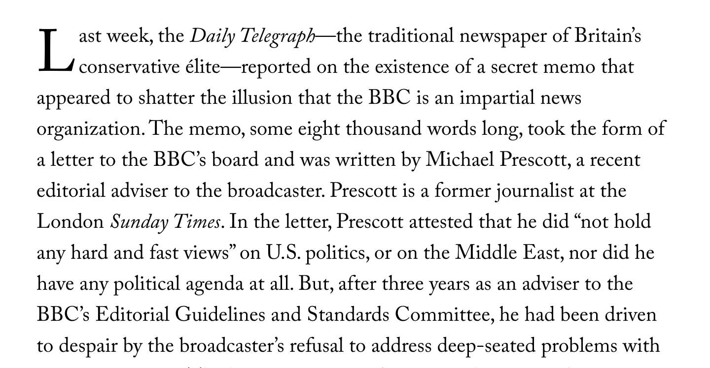

### Computer Modern 和 Latin Modern

Computer Modern是Tex发明者Knuth为TeX排版系统设计的字体，Latin Modern则是21世纪以后以 Computer Modern为基础继续开发的，发生的修改包括增加了字体类型与字重、拉丁字母变体与组合变音记号的支持。目前大多数TeX发行版比如Tex Live都默认使用Latin Modern Roman作为默认衬线字体，Latin ModernMath作为数学公式环境的默认字体，类似风格的还有[Linux Libertine](https://libertine-fonts.org)

### Optima

越战纪念碑字体，充满人文主义情怀，优美的黄金比例字形，适合于珠宝、杂志等

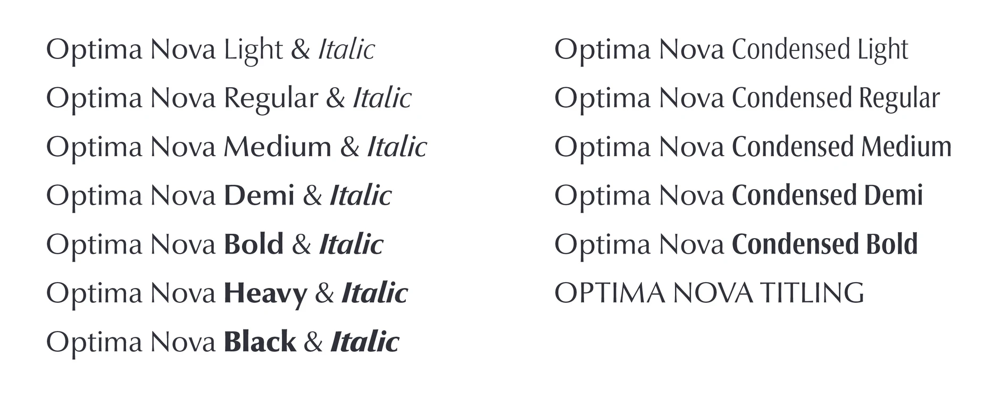

### Trajan

文化感浓重，前身是「古罗马大写字母」属于石碑体，泰坦尼克号电影海报标题字体。

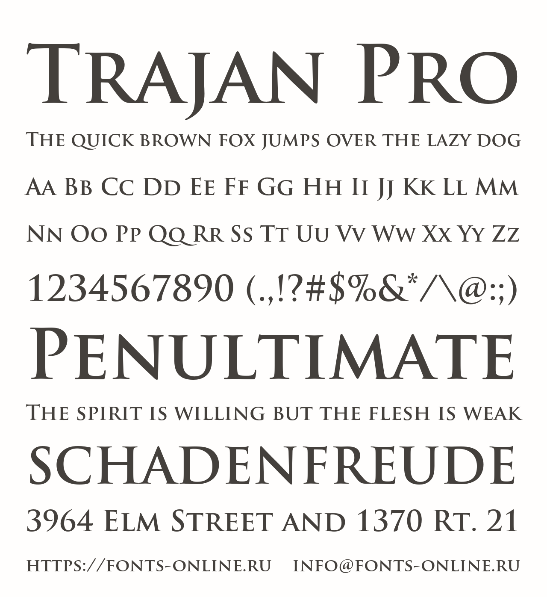

# 无衬线体

### [Futura](https://fonts.adobe.com/fonts/futura-pt)

包豪斯现代风格，设计时使用了大量的尺子和圆规，用数字和几何确定笔画的位置，代表了德国设计的冷峻和可靠。宜家大量使用了Futura字体。
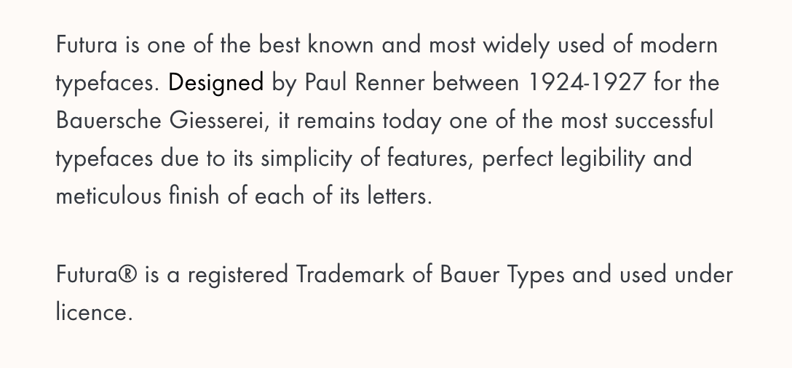

### Din

德国交通标识和公共空间使用的字体，德国标准字体， 机械感、充满力量、工业属性

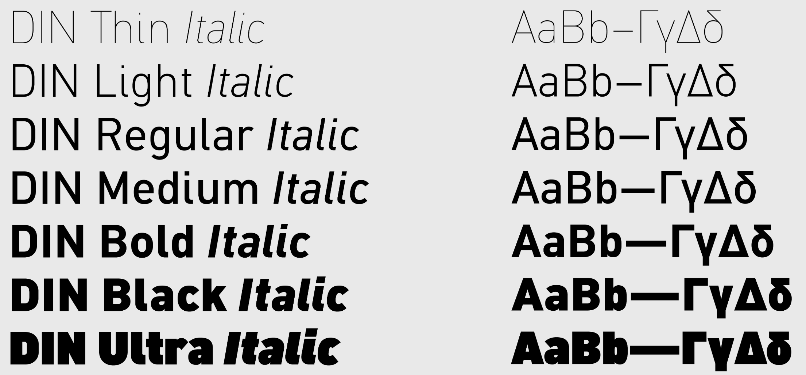

### Adele

纤细饱满，用于海报广告中给人舒适的感觉。
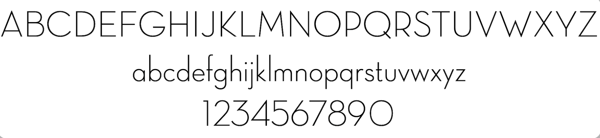

### Morganite

Morganite字体是印度新德里的设计师Rajesh Rajput设计的，印度片里广告牌上经常能看到，免费可商用，字体包括18种风格，从细到粗，还有倾斜体，风格非常优美，适用于电商设计价格数字展示及电影海报设计

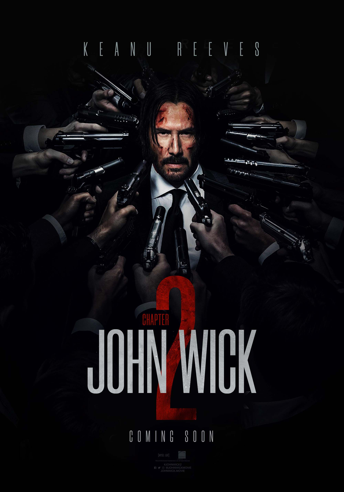

# 中文

### 霞鹜文楷

基于日文开源字体[Klee](https://github.com/fontworks-fonts/Klee/)制作而成，更像是圆润一点的宋体，阅读体验很好

### MacOS内置中文字体

华康金刚黑（也就是PingFang SC），华康宋体（SongTi SC），华康楷体，华康仿宋体

> 授权说明：根据Apple 官方发布的字体授权内容， 用户只要是在使用合法Mac OS 及相关软件的前提下，使用制作、显示、打印各种文件、图片、视频，都是在合法的授权范围，无论是商用或非商用。
> 只要不内嵌字体，可以随意使用

# Google font

### 无衬线体

- [Josefin Sans](https://fonts.google.com/specimen/Josefin+Sans)
- [Jost](https://fonts.google.com/specimen/Jost)

### 衬线体

- [Josefin Slab](https://fonts.google.com/specimen/Josefin+Slab)
- [Joan](https://fonts.google.com/specimen/Joan)
- [EB Garamond](https://fonts.google.com/specimen/EB+Garamond)
- [Cormorant Garamond](https://fonts.google.com/specimen/Cormorant+Garamond)
- [GFS Didot](https://fonts.google.com/specimen/GFS+Didot)
- [Bodoni Moda](https://fonts.google.com/specimen/Bodoni+Moda)

### 花体

- [Meddon](https://fonts.google.com/specimen/Meddon)
- [Clicker Script](https://fonts.google.com/specimen/Clicker+Script?preview.text=Page%20not%20fountd%20)
- [Stalemate](https://fonts.google.com/specimen/Stalemate?preview.text=Page%20not%20fountd%20)
- [Tangerine](https://fonts.google.com/specimen/Tangerine?preview.text=404%20ffff)
- [Courier Prime](https://fonts.google.com/specimen/Courier+Prime)「老式打印机字体」
- Zapfino「MacOS内置花体」
