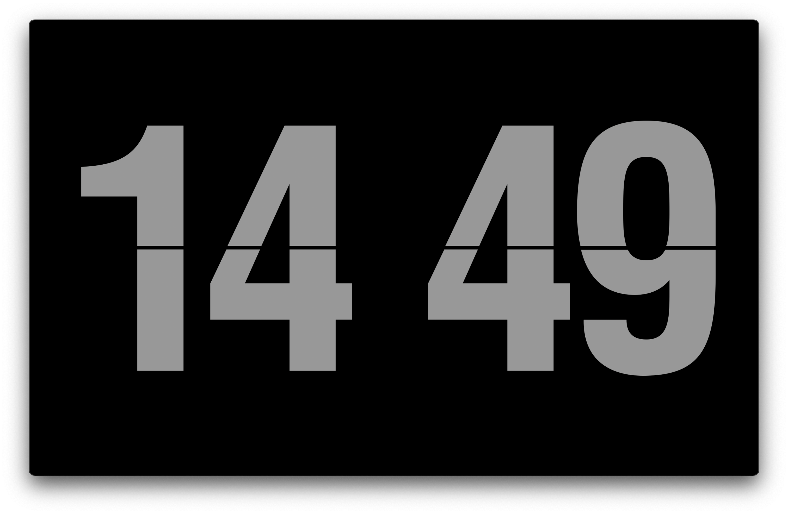
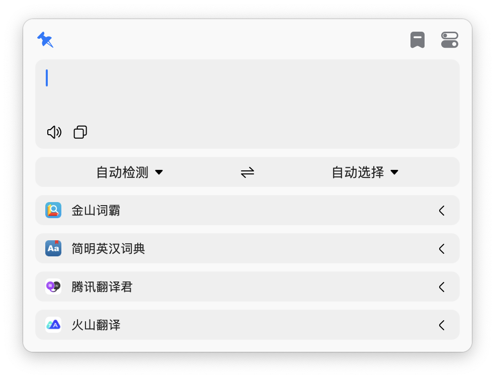
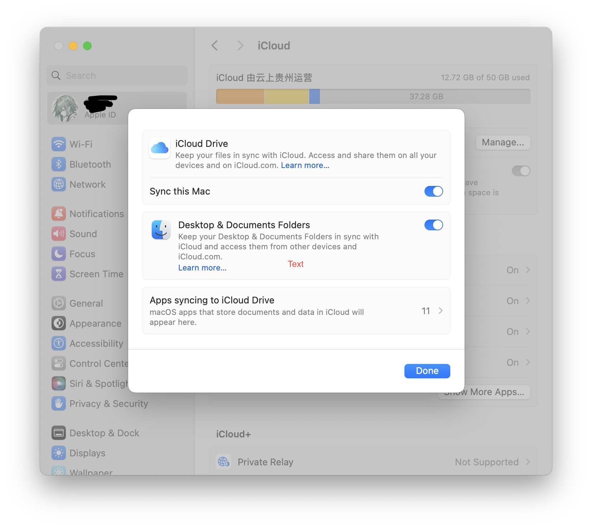

最近重装系统，记录一下新系统配置流程

## 代理 & Homebrew
第一步当然是安装Homebrew啦，安装Homebrew前需要先配置代理，代理工具推荐v2raya，但v2raya需要通过Homebrew安装:(,
所以记得备份一个ClashX的安装包或者从App Store安装手机版的Shadowrocket，给终端配置好代理之后执行
```sh
/bin/bash -c "$(curl -fsSL https://raw.githubusercontent.com/Homebrew/install/HEAD/install.sh)"
```
给brew添加软件源（字体和v2raya)
```sh
brew tap v2raya/v2raya
brew tap homebrew/cask-fonts
```
## 必备App
#### Fliqlo，一款简约好看的Screen Saver


```
brew install --cask fliqlo
```

#### Bob：翻译软件，支持OCR翻译



通过App Store（¥30）安装，也可以在[GitHub](https://github.com/ripperhe/Bob)下载社区版（已不再维护）

#### 全局搜索、脚本、改键
```sh
brew install --cask raycast hammerspoon karabiner‐elements
```

#### 解压和压缩
```sh
brew install --cask maczip the‐unarchiver
```

#### 多媒体
```sh
brew insatll --cask iina xld
```
**IINA：** 一款开源的视频播放器，部分视频格式默认的 QuickTime Player 不支持，

**XLD：** 音频转码小工具，有搭建本地音乐库的打算，纯 flac 格式太耗空间，一般会转为较小的 m4a 格式

#### Typora & Downie 4

最好用的 Markdown 编辑器 & 最好用的视频下载器（bilibili&YouTube），但是都付费:(

## 命令行工具
#### Basic Tools
```sh
brew install eza bat ripgrep fd difftastic fzf zoxide tmux cmake v2raya
```
eza：代替ls、tree，bat：代替cat，zoxide：常用路径跳转，其他都比较常见不逐一介绍
#### 笔记 & 博客
```sh
brew install typst hugo
```

#### 开发环境
```sh
# editor & terminal
brew install --cask visual‐studio‐code alacritty wezterm
# c/c++
brew install llvm
# rust
curl ‐‐proto '=https' ‐‐tlsv1.2 ‐sSf https://sh.rustup.rs | sh
# golang
brew install golang
```

## 系统设置
#### 更改截图默认储存位置
同时按下 Command - Shift - 5 会弹出截屏选取框和相关设定， 点击下方的“选项”按钮，选择其他位置

#### 加快切屏速度
```sh
defaults write com.apple.dock workspaces‐edge‐delay 0;killall Dock
# 恢复默认
defaults delete com.apple.dock workspaces‐edge‐delay;killall Dock
```

#### 关闭桌面切换动画
系统设置 –> 辅助功能 –> 显示 –> 减弱用户界面的动态效果:打开

####  Finder 设置
显示文件后缀, choose Finder > Settings > Advancedi > “Show all filename extensions”

更改 New window 默认打开文件 choose Finder > Settings > General
#### 将 Desktop&Documents 加入 iCloud Drive
Apple menu  > System Settings > Click Apple ID > iCloud > iCloud Drive. Below iCloud Drive, check that Sync this Mac is turned on. Turn on Desktop & Documents Folders.

