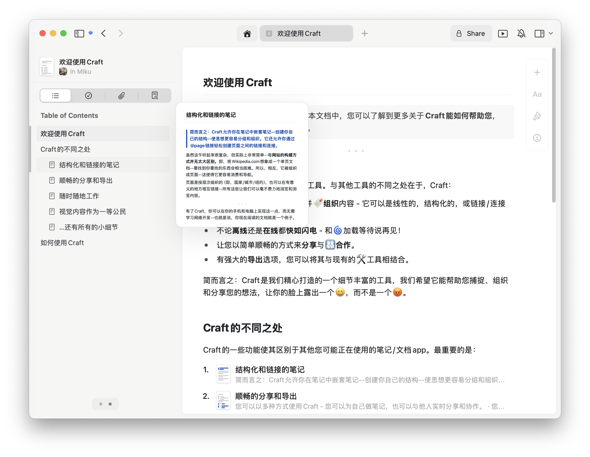

最近重装系统，记录一下新系统配置流程

大部分软件都需要从需要通过Homebrew安装，鉴于糟糕的网络情况:(
需要在 iCloud 备份一个 Clash 安装包或通过外区 App Store 安装 Shadowrocket，

### Turn on iCloud Drive Sync

 `->` System Settings `->` Apple Account `->` iCloud `->` Drive.
turned on `Sync this Mac` and `Desktop & Documents Folders`


打开 iCloud 等待 Clash 安装包同步，顺便修改鼠标速度，方便后续操作

安装完成后给终端配置代理，安装 Homebrew

```sh
/bin/bash -c "$(curl -fsSL https://raw.githubusercontent.com/Homebrew/install/HEAD/install.sh)"
```

# 命令行配置

同步配置文件

```sh
git clone https://github.com/x39x/config ~/.dotfile
cd ~/.dotfile && ./install
```

常用工具

```txt
alacritty ghostty font-iosevka-term-nerd-font
zoxide tree yazi fd ripgrep fzf
bat difftastic neovim fish tldr
typst tmux cmake
```

编程环境配置

```txt
node@lts uv golang rust
```

- 参考: [Rust 安装与环境变量配置](/wiki/rust-install-config)
- 参考: [Mac Node 环境配置](/wiki/mac-node-env)
- 参考: [Python 虚拟环境配置](/wiki/python-venv)
- 参考: [Goalng 常用命令与环境配置](/wiki/go-command-config)

# App

### 常用

```txt
raycast hammerspoon karabiner‐elements
wechat qq discord steam
google-chrome arc chatgpt
skim visual‐studio‐code keycastr
```

### 解压和压缩

```txt
maczip the‐unarchiver
```

### 多媒体

```txt
iina xld fliqlo
```


- **Fliqlo：** 简约风 Screen Saver
- **IINA：** 一款开源的视频播放器
- **XLD：** 音频转码小工具

### Downie 4

视频下载（bilibili&YouTube），付费:(

# App Store

### Bob：翻译软件，支持 OCR 翻译


### Craft Doc：笔记



# 系统设置

### Finder 设置

1. choose Finder `->` Settings `->` Advancedion

- [x] Show all filename extensions

* [ ] Show warning before changing an extension
* [ ] Show warning before removing from iCloud Drive

2. 更改 New window 默认打开文件

choose Finder `->` Settings `->` General `->` New Finder windows show: Downloads

3. 调整 sidebar 显示文件夹

### 关闭桌面切换动画

系统设置 –> 辅助功能 –> 显示 –> 减弱用户界面的动态效果:打开

### 关闭触发角

系统设置 –> Desktop & Dock –> 最下方 –> Hot Corners

### Keyboard

- 系统设置 `->` Keyboard`->` 关闭dictation快捷键
- 系统设置 `->` Keyboard Shortcuts `->` 修改 Screenshot 快捷键
- 系统设置 `->` Keyboard Shortcuts `->` 修改 Mission Control 快捷键
- Keyboard Press and hold

```bash
defaults write NSGlobalDomain ApplePressAndHoldEnabled -bool false
```

### 加快切屏速度

```sh
defaults write com.apple.dock workspaces‐edge‐delay 0;killall Dock
defaults delete com.apple.dock workspaces‐edge‐delay;killall Dock # 恢复默认
```

### 更改截图默认储存位置

同时按下 Command - Shift - 5 会弹出截屏选取框和相关设定，点击下方的“选项”按钮，选择其他位置

### Safari

Advanced `->` Show features for web developers

### 账号与安全

打开 find my(开启位置服务)、登陆 google账号、验证常用邮箱

# 其他

Homebrew 安装后需配置环境变量

```bash
# add bellow to shell profile
eval "$(/opt/homebrew/bin/brew shellenv)"
```

### basic usage

```bash
# 新增软件源
brew tap homebrew/cask-fonts
# 管理版本
brew unlink python@3.8
brew link python@3.9
```

### 切换国内镜像

```bash
export HOMEBREW_API_DOMAIN="https://mirrors.tuna.tsinghua.edu.cn/homebrew-bottles/api"
export HOMEBREW_BOTTLE_DOMAIN="https://mirrors.tuna.tsinghua.edu.cn/homebrew-bottles"
export HOMEBREW_BREW_GIT_REMOTE="https://mirrors.tuna.tsinghua.edu.cn/git/homebrew/brew.git"
export HOMEBREW_CORE_GIT_REMOTE="https://mirrors.tuna.tsinghua.edu.cn/git/homebrew/homebrew-core.git"
export HOMEBREW_PIP_INDEX_URL="https://pypi.tuna.tsinghua.edu.cn/simple"
```

详细可参考[清华镜像站](https://mirrors.tuna.tsinghua.edu.cn/help/homebrew/)

### Brew bundle

```sh
# 执行brew bundle dump备份命令
brew bundle dump --describe --force --file="~/.dotfile/Brewfile"
# 批量安装软件
brew bundle --file="~/.dotfile/Brewfile"
```

# Tips

### Mac 签名 app

```bash
sudo xattr -rd com.apple.quarantine /Applications/x.app
```

### Emoj Shortcuts

Control + Command + Space
