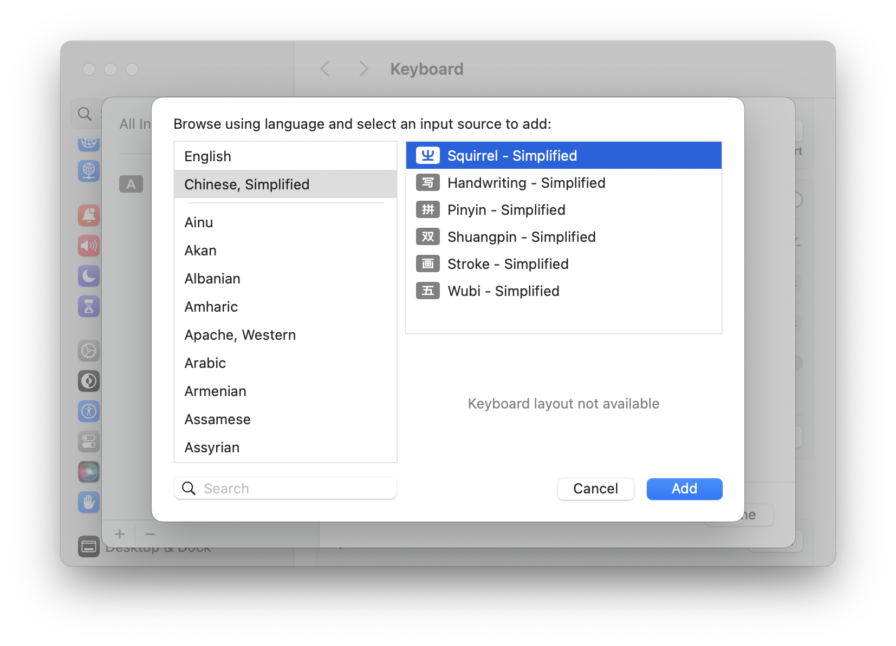
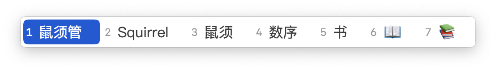
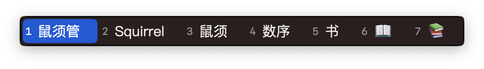
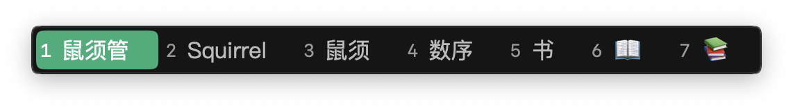

## 简介

[Riem（中州韵) ](https://rime.im/)是一个开源跨平台的输入法框架，支持全拼、双拼、五笔、仓颉、粤语拼音、吴语拼音等等几乎市面上可以见到的所有输入方案，
Rime 每个平台的客户端实现都不同

- MacOS：鼠须管（Squirrel）
- windows：小狼毫（Weasel）
- Linux：ibus-rime、fcitx5-rime、fcitx-rime

各平台配置文件位置不同，但部分配置文件可以通用

**优点：** 可以根据需求自定义、保护隐私、

**缺点：** 配置复杂繁琐、需要自己维护词库

## 安装 Squirrel

使用 homebrew 安装，安装过程中需要输入开机密码以获得sudo权限

```
brew install --cask squirrel
```

安装完成后可以在系统设置 Keyboard `->` Input Sources `->`点击➕号 `->` Simplified Chinese 找到 Squirrel



添加 Squirrel 后就可以使用 Squirrel 自带的明月拼音（全拼）打字了，但 Squirrel 默认配置和词库都不足以支持日常使用，自己维护一套词库➕配置又非常耗时费力，推荐使用开源配置框架[雾凇拼音](https://dvel.me/posts/rime-ice/)

## 配置 Squirrel
自定义配置文件位置
```
~/Library/Rime  (MacOS)
%APPDATA%\Rime  (Windows)
```
克隆 rime-ice（雾凇拼音）到系统对应配置文件路径

```bash
mv ~/Library/Rime ~/Rime.bak
git clone --depth=1 https://github.com/iDvel/rime-ice.git Rime
```
配置文件结构如下

```
.
├── default.yaml                # 一些全局设置

├── rime_ice.schema.yaml        # 全拼方案
├──                             # 以下为双拼方案
├── double_pinyin.schema.yaml         # 自然码
├── double_pinyin_abc.schema.yaml     # 智能abc
├── double_pinyin_flypy.schema.yaml   # 小鹤
├── double_pinyin_mspy.schema.yaml    # 微软
├── double_pinyin_sogou.schema.yaml   # 搜狗
├── double_pinyin_ziguang.schema.yaml # 紫光

├── rime_ice.dict.yaml          # 挂载词库
├── cn_dicts/                   # 词库目录

├── melt_eng.schema.yaml        # 英文方案，作为次翻译器挂载到拼音方案
├── melt_eng.dict.yaml          # 挂载词库
├── en_dicts/                   # 词库目录

├── radical_pinyin.schema.yaml  # 部件拆字方案，作为反查挂载到拼音方案
├── radical_pinyin.dict.yaml    # 部件拆字词库

├── custom_phrase.txt           # 自定义短语
├── symbols_v.yaml              # 全拼 v 模式
├── symbols_caps_v.yaml         # 双拼 V 模式
├── opencc/                     # 词语映射，Emoji
├── rime.lua                    # 引入 Lua 脚本
├── lua/                        # 各个 Lua 脚本

├── squirrel.yaml  # 鼠须管的前端配置文件(MacOS)
└── weasel.yaml    # 小狼毫的前端配置文件(Windows)

```

比较重要的有
- `default.yaml`，全局配置
- `double_pinyin*.schema.yaml` ，具体双拼方案配置，只需要关心你使用的，不使用双拼忽视即可
- `squirrel.yaml` （MacOS）/ `weasel.yaml`（Windows），UI 相关配置

为了方便后续同步 rime-ice 的配置和词库，不建议直接修改以上文件，新建以下文件

- `default.custom.yaml`  ->  `default.yaml`
- `double_pinyin*.custom.yaml`  -> `double_pinyin*.schema.yaml`
- `squirrel.custom.yaml/weasel.custom.yaml` -> `squirrel.yaml/weasel.yaml`

以补丁的形式只修改我们需要的部分，以`.custom.yaml`结尾的文件已经被添加进 rime-ice 的 gitignore 中，不会影响 rime-ice 仓库本身，

补丁文件的格式如下，以`patch:`作为开头，加一层缩进，将需要修改的部分从对应源文件里复制过来参考源文件注释修改即可，

```yaml
# default.custom.yaml  参考default.yaml
patch:
    # 方案列表 可以直接删除或注释不需要的方案
    schema_list:
      - schema: double_pinyin              # 自然码双拼
      # - schema: rime_ice                 雾凇拼音（全拼）
      # - schema: double_pinyin_abc        智能 ABC
      # - schema: double_pinyin_mspy       微软双拼
      # - schema: double_pinyin_sogou      搜狗双拼
      # - schema: double_pinyin_flypy      小鹤双拼
      # - schema: double_pinyin_ziguang    紫光双拼

  # 菜单
  menu:
    page_size: 7  # 候选词个数
```

## 更新与配置管理
手动更新时只需要进入配置目录，执行`git pull`命令

可以将这三个补丁文件放在我们的 dotfile 目录下统一管理，然后软链接到配置目录，我使用[dotbot](https://github.com/anishathalye/dotbot) 统一管理我的配置文件，并写了一个小脚本用来拉取和更新rime-ice仓库

```bash
#!/usr/bin/env bash
RED='\033[0;31m'
GREEN='\033[0;32m'
NC='\033[0m'

RIME_PATH="$HOME/Library/Rime"
RIME_URL="https://github.com/iDvel/rime-ice"

# 检查Rime配置文件是否存在
if [ -e "$RIME_PATH" ]; then
        printf  "${GREEN}File '$RIME_PATH' exists.${NC}\n"
        # 检查是否是Git仓库
        if [ -d "$RIME_PATH/.git" ]; then
                printf "${GREEN}Updating...${NC}\n"
                cd "$RIME_PATH" || exit
                git pull
        else
                printf "${RED}'$RIME_PATH' is not a Git repository. Backing up and cloning...${NC}\n"
                mv "$RIME_PATH" "$HOME/Rime.bak"
                git clone "$RIME_URL" "$RIME_PATH"
        fi
else
        printf "${RED}'$RIME_PATH' does not exist. Cloning repository...${NC}\n"
        git clone "$RIME_URL" "$RIME_PATH"
fi

```


## 主题

效果展示
- macOS


- 微信



配置
```
  preset_color_schemes:
    macos_light:
      name: "MacOS Light"
      font_point: 16
      label_font_point: 12
      comment_font_point: 16
      candidate_list_layout: linear           # 候选排布：层叠 stacked | 行 linear | tabled
      translucency: false                     # 磨砂： false | true
      mutual_exclusive: false                 # 色不叠加： false | true
      border_height: 1                        # 外边框 高
      border_width: 1                         # 外边框 宽
      corner_radius: 5                        # 外边框 圆角半径
      hilited_corner_radius: 5                # 选中框 圆角半径
      surrounding_extra_expansion: 0          # 候选项背景相对大小？
      shadow_size: 0                          # 阴影大小
      line_spacing: 5                         # 行间距
      base_offset: 0                          # 字基高
      alpha: 1                                # 透明度，0~1
      back_color: 0xFFFFFF                    # 底色
      hilited_candidate_back_color: 0xD75A00  # 选中底色
      label_color: 0x999999                   # 序号颜色
      hilited_candidate_label_color: 0xFFFFFF # 选中序号颜色
      candidate_text_color: 0x3c3c3c          # 文字颜色
      hilited_candidate_text_color: 0xFFFFFF  # 选中文字颜色
      comment_text_color: 0x999999            # 注颜色
      hilited_comment_text_color: 0xFFFFFF    # 选中注颜色
      candidate_back_color: 0xFFFFFF          # 候选项底色
      border_color: 0xFFFFFF                  # 外边框颜色

    macos_dark:
      name: "MacOS Dark"
      font_point: 16
      label_font_point: 12
      comment_font_point: 16
      candidate_list_layout: linear          # 候选排布：层叠 stacked | 行 linear | tabled
      candidate_format: "%c\u2005%@\u2005"    # 编号 %c 和候选词 %@ 前后的空间
      translucency: false                     # 磨砂： false | true
      mutual_exclusive: false                 # 色不叠加： false | true
      border_height: 1                        # 外边框 高
      border_width: 1                         # 外边框 宽
      corner_radius: 5                        # 外边框 圆角半径
      hilited_corner_radius: 5                # 选中框 圆角半径
      surrounding_extra_expansion: 0          # 候选项背景相对大小？
      shadow_size: 0                          # 阴影大小
      line_spacing: 5                         # 行间距
      base_offset: 0                          # 字基高
      alpha: 1                                # 透明度，0~1
      back_color: 0x1f1e2d                    # 底色
      hilited_candidate_back_color: 0xD75A00  # 选中底色
      label_color: 0x999999                   # 序号颜色
      hilited_candidate_label_color: 0xFFFFFF # 选中序号颜色
      candidate_text_color: 0xe9e9ea          # 文字颜色
      hilited_candidate_text_color: 0xFFFFFF  # 选中文字颜色
      comment_text_color: 0x999999            # 注颜色
      hilited_comment_text_color: 0x999999    # 选中注颜色
      candidate_back_color: 0x1f1e2d          # 候选项底色
      border_color: 0x050505                  # 外边框颜色

    wechat_light:
      name: "Wechat Light"
      font_point: 16
      label_font_point: 13
      comment_font_point: 16
      candidate_list_layout: linear           # 候选排布：层叠 stacked | 行 linear | tabled
      translucency: false                     # 磨砂： false | true
      mutual_exclusive: false                 # 色不叠加： false | true
      border_height: 1                        # 外边框 高
      border_width: 1                         # 外边框 宽
      corner_radius: 5                        # 外边框 圆角半径
      hilited_corner_radius: 5                # 选中框 圆角半径
      surrounding_extra_expansion: 0          # 候选项背景相对大小？
      shadow_size: 0                          # 阴影大小
      line_spacing: 5                         # 行间距
      base_offset: 0                          # 字基高
      alpha: 1                                # 透明度，0~1
      back_color: 0xFFFFFF                    # 底色
      hilited_candidate_back_color: 0x79af22  # 选中底色
      label_color: 0x999999                   # 序号颜色
      hilited_candidate_label_color: 0xFFFFFF # 选中序号颜色
      candidate_text_color: 0x3c3c3c          # 文字颜色
      hilited_candidate_text_color: 0xFFFFFF  # 选中文字颜色
      comment_text_color: 0x999999            # 注颜色
      hilited_comment_text_color: 0x999999    # 选中注颜色
      candidate_back_color: 0xFFFFFF          # 候选项底色
      border_color: 0xFFFFFF                  # 外边框颜色

    wechat_dark:
      name: "Wechat Dark"
      font_point: 16
      label_font_point: 13
      comment_font_point: 16
      candidate_list_layout: linear           # 候选排布：层叠 stacked | 行 linear
      translucency: false                     # 磨砂： false | true
      mutual_exclusive: false                 # 色不叠加： false | true
      border_height: 1                        # 外边框 高
      border_width: 1                         # 外边框 宽
      corner_radius: 5                        # 外边框 圆角半径
      hilited_corner_radius: 5                # 选中框 圆角半径
      surrounding_extra_expansion: 0          # 候选项背景相对大小？
      shadow_size: 0                          # 阴影大小
      line_spacing: 5                         # 行间距
      base_offset: 0                          # 字基高
      alpha: 1                                # 透明度，0~1
      back_color: 0x151515                    # 底色
      hilited_candidate_back_color: 0x79af22  # 选中底色
      label_color: 0x999999                   # 序号颜色
      hilited_candidate_label_color: 0xFFFFFF # 选中序号颜色
      candidate_text_color: 0xbbbbbb          # 文字颜色
      hilited_candidate_text_color: 0xFFFFFF  # 选中文字颜色
      comment_text_color: 0x999999            # 注颜色
      hilited_comment_text_color: 0xFFFFFF    # 选中注颜色
      candidate_back_color: 0x151515          # 候选项底色
      border_color: 0x292929                  # 外边框颜色

```

## 参考

[我的配置](https://github.com/x39x/config/tree/master/Rime)

更多详细配置请参考[rime-ice](https://dvel.me/posts/rime-ice/)以及[ Squirrel ](https://rime.im/docs/)文档
