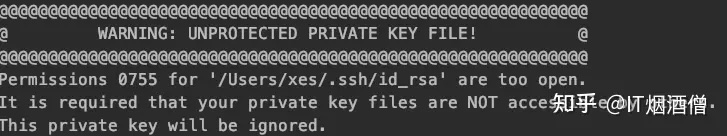

使用 `ssh-keygen` 生成密钥对，生成密钥对时需要生成一个密码，此密码是用来解锁私钥的密码，可直接回车将密码设置为空，如果设置非空密码，将私钥添加至 ssh-agent 后可避免重复输入（下文有介绍)

```bash
# 生成一个新的 4096 位 SSH 密钥对，并添加注释："MacBook@user1"
ssh-keygen  -b 4096 -C MacBook@user1 -f /Users/username/.ssh/id_rsa
# 修改 .ssh/id_rsa 密码
ssh-keygen  -p  -f /Users/username/.ssh/id_rsa

```

ssh-keygen常见参数：

```txt
-p: 修改已生成 key 密码
-t：指定生成密钥的类型，默认使用SSH2d的rsa
-f：指定生成密钥的 path，默认 ~/.ssh/id_rsa（私钥id_rsa，公钥id_rsa.pub）
-b：指定密钥长度（bits），RSA最小要求768位，默认是2048位；DSA密钥必须是1024位（FIPS 1862标准规定）
-C：添加注释；服务端辨认公钥
-R  hostname：从known_hosta（第一次连接时就会在家目录.ssh目录下生产该密钥文件）文件中删除所有属于hostname的密钥
-e：读取openssh的私钥或者公钥文件；
-i：读取未加密的ssh-v2兼容的私钥/公钥文件，然后在标准输出设备上显示openssh兼容的私钥/公钥；
-l：显示公钥文件的指纹数据；
-q：静默模式；
```

生成密钥对后上传公钥之服务端

参考[SSH 上传文件](/wiki/ssh-transfer-file)

# 手动指定私钥连接

```sh
# -i 指定私钥所在位置
ssh -i ~/.sshkey/id_fedora -p 2222 user1@xxx.xxx.xxx.xxx
```

# id_rsa 和 id_rsa.pub 文件权限

如果私钥权限过低会出现一下错误


私钥、公钥应该保证除 root 用户外都不可写，除连接用户外都不可读，

> MacOS root 用户组为 root:wheel，普通用户组为 staff ，linux root用户组为 root:root

### 设置所有权并只保留 root 的读写权限

```sh
# 设置私钥所有权为 root (MacOS)
sudo chown root:wheel .sshkey/id_rsa
# 设置公钥所有权为 root (Fedora Linux)
sudo chown root:root .sshpub/id_rsa.pub
# 只有 root 可读写
sudo chmod 600 .sshpub/id_rsa.pub

```

### 使用 ACL 给指定用户开放读取权限

macOS 使用 chmod +a 设置 ACL 条目，而 Linux 使用 setfacl

```sh
# 允许 user1 用户读取私钥
sudo setfacl -m u:user1:r-- .sshkey/id_rsa.pub
getfacl .sshpub/id_rsa.pub # 查看 ACL 权限：
# 📝 macOS 特有 ACL 管理（chmod +a）
sudo chmod +a "user1 allow read" .sshkey/id_rsa
```

# 使用 `ssh-agent` 管理密钥对

### ssh-agent

ssh-agent 是一个后台程序，用于管理 SSH 密钥对。当你使用 SSH 连接到远程服务器时，通常需要提供私钥来验证身份。ssh-agent 的作用是存储私钥并在需要时自动提供，避免每次连接时都手动输入私钥密码。

主要功能：

- 保持 SSH 私钥在内存中，避免每次使用 SSH 时都需要输入密码。
- 在一个会话中可以使用多个 SSH 密钥。

### ssh-add

ssh-add 是用来向 ssh-agent 添加或移除密钥的命令。你可以通过它将私钥添加到 ssh-agent 中，这样就可以在后续的 SSH 会话中自动使用这些密钥。

添加到 agent 的密钥只在当前登录会话中有效，一旦你关闭终端、注销、重启，SSH Agent 进程就会结束，密钥就会被清除，用于在同一会话下的多次连接，避免重复输入私钥密码

```bash
ssh-add .ssh/id_rsa # 添加密钥，如果私钥设置了密码，第一次需要输入密码
ssh-add -d .ssh/id_rsa # 移除密钥
ssh-add -l # 列出密钥
```
